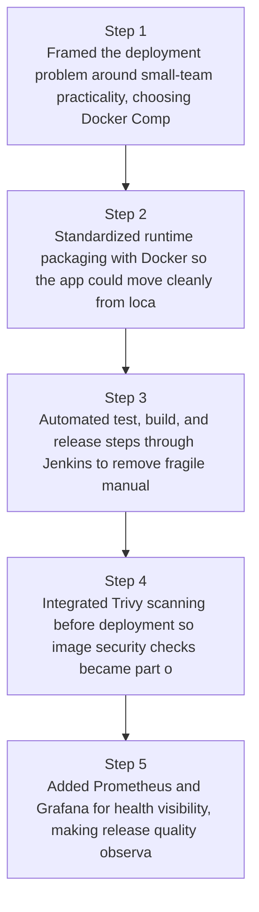
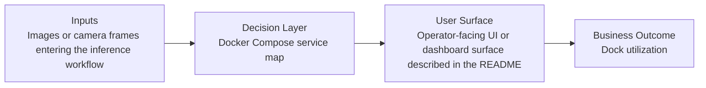
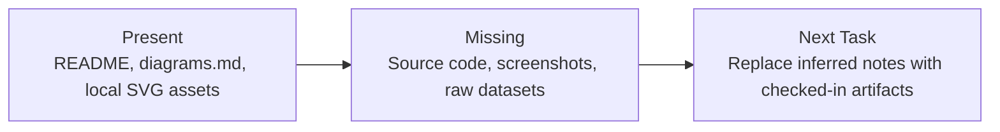

# Small-Team DevOps Delivery Pipeline Diagrams

Generated on 2026-04-26T04:29:37Z from README narrative plus project blueprint requirements.

## CI/CD pipeline stages

## Docker Compose service map

## Evidence Gap Map

